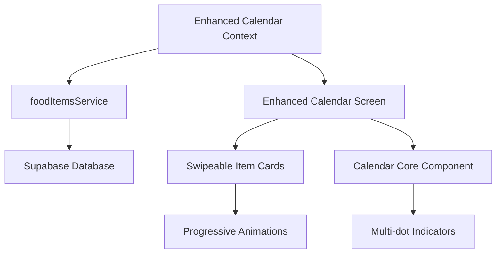

# Enhanced Calendar Integration Guide

## Overview

This guide provides step-by-step instructions for integrating the newly developed enhanced calendar system into the existing FridgeWise application. The enhanced calendar features improved UX, performance optimizations, and accessibility enhancements.

## Current State Analysis

### Existing Implementation

- **Main Calendar Screen**: `app/(tabs)/calendar.tsx` - Uses `EnhancedCalendarWithIndicators`
- **Calendar Components**: Multiple calendar components in `components/calendar/`
- **Data Service**: `services/foodItems.ts` - Provides food item data with urgency calculations
- **Navigation**: Integrated with expo-router and custom tab bar

### Enhanced Implementation

- **New Core Calendar**: `components/EnhancedCalendarScreen.tsx` - Production-ready enhanced calendar
- **State Management**: `contexts/CalendarContext.tsx` - Centralized calendar state with optimistic updates
- **Performance Hooks**: `hooks/useEnhancedCalendar.ts` - Performance monitoring and data management
- **Swipe Actions**: `components/EnhancedSwipeableItemCard.tsx` - Progressive animations and haptic feedback

## Integration Strategy

### Phase 1: Gradual Migration (Recommended)

#### Step 1: Add Enhanced Calendar as Alternative View

**File**: `app/(tabs)/calendar.tsx`

**Action**: Add a toggle to switch between existing and enhanced calendar:

```typescript
import { useState } from 'react';
import EnhancedCalendarScreen from '@/components/EnhancedCalendarScreen';
import { TouchableOpacity, Text } from 'react-native';

export default function CalendarScreen() {
  const [useEnhanced, setUseEnhanced] = useState(false);

  const handleToggle = () => setUseEnhanced(!useEnhanced);

  return (
    <SafeAreaView style={[styles.container, { backgroundColor }]} edges={["top"]}>
      {/* Development Toggle */}
      <TouchableOpacity onPress={handleToggle} style={styles.toggleButton}>
        <Text>Use {useEnhanced ? 'Original' : 'Enhanced'} Calendar</Text>
      </TouchableOpacity>

      {useEnhanced ? (
        <EnhancedCalendarScreen />
      ) : (
        // ... existing calendar implementation
      )}
    </SafeAreaView>
  );
}
```

#### Step 2: Wrap App with Enhanced Calendar Context

**File**: `app/_layout.tsx`

**Action**: Add CalendarProvider to app root:

```typescript
import { CalendarProvider } from "@/contexts/CalendarContext";

export default function RootLayout() {
  return <CalendarProvider>{/* Existing app structure */}</CalendarProvider>;
}
```

#### Step 3: Test Enhanced Calendar

1. Run the app with the toggle enabled
2. Test all calendar interactions:
   - Date selection
   - Month navigation
   - Item interactions
   - Swipe actions
   - Accessibility features
3. Monitor performance using React DevTools
4. Validate data consistency with existing service

#### Step 4: Full Migration

Once testing is complete, replace the calendar implementation:

```typescript
// Remove toggle and use enhanced calendar directly
export default function CalendarScreen() {
  return (
    <SafeAreaView
      style={[styles.container, { backgroundColor }]}
      edges={["top"]}
    >
      <EnhancedCalendarScreen />
    </SafeAreaView>
  );
}
```

### Phase 2: Direct Replacement (Alternative)

For immediate full replacement:

**File**: `app/(tabs)/calendar.tsx`

```typescript
import React from "react";
import { SafeAreaView } from "react-native-safe-area-context";
import EnhancedCalendarScreen from "@/components/EnhancedCalendarScreen";
import { useThemeColor } from "@/hooks/useThemeColor";

export default function CalendarScreen() {
  const backgroundColor = useThemeColor(
    { light: "#FFFFFF", dark: "#000000" },
    "background"
  );

  return (
    <SafeAreaView style={{ flex: 1, backgroundColor }} edges={["top"]}>
      <EnhancedCalendarScreen />
    </SafeAreaView>
  );
}
```

## Service Integration

### Enhanced Calendar Service Integration

The enhanced calendar automatically integrates with the existing `foodItemsService`:

```typescript
// Enhanced calendar uses these existing service methods:
-foodItemsService.getItemsByExpiryDate() - // For calendar data
  foodItemsService.logUsage() - // For mark used action
  foodItemsService.updateItem() - // For extend expiry action
  foodItemsService.deleteItem(); // For delete action
```

### Data Flow Integration



## Configuration Options

### Calendar Context Configuration

**File**: `contexts/CalendarContext.tsx`

```typescript
const CalendarProvider = ({ children, config }) => {
  const defaultConfig = {
    enableOptimisticUpdates: true,
    performanceMonitoring: true,
    maxCacheSize: 100,
    preloadMonths: 1,
    animationDuration: 300,
    hapticFeedback: true,
  };

  // Use custom config or defaults
  const activeConfig = { ...defaultConfig, ...config };

  // Provider implementation...
};
```

### Performance Configuration

**File**: `hooks/useEnhancedCalendar.ts`

```typescript
const useEnhancedCalendar = (options = {}) => {
  const defaultOptions = {
    enablePerformanceMonitoring: true,
    memoryThreshold: 50, // MB
    renderTimeThreshold: 100, // ms
    maxConcurrentRequests: 3,
  };

  // Use custom options or defaults
  const activeOptions = { ...defaultOptions, ...options };

  // Hook implementation...
};
```

## Testing Integration

### Unit Tests

Update existing test files to work with enhanced calendar:

**File**: `__tests__/Calendar.test.tsx`

```typescript
import { render, screen } from "@testing-library/react-native";
import { CalendarProvider } from "@/contexts/CalendarContext";
import EnhancedCalendarScreen from "@/components/EnhancedCalendarScreen";

const TestWrapper = ({ children }) => (
  <CalendarProvider>{children}</CalendarProvider>
);

describe("Enhanced Calendar Integration", () => {
  it("renders enhanced calendar correctly", () => {
    render(
      <TestWrapper>
        <EnhancedCalendarScreen />
      </TestWrapper>
    );

    expect(screen.getByTestId("enhanced-calendar-screen")).toBeTruthy();
  });

  it("integrates with food items service", async () => {
    // Test service integration
  });
});
```

### Performance Tests

**File**: `__tests__/CalendarPerformance.test.tsx`

```typescript
import { renderHook } from "@testing-library/react-hooks";
import { useCalendarPerformance } from "@/hooks/useEnhancedCalendar";

describe("Calendar Performance Integration", () => {
  it("monitors performance metrics", () => {
    const { result } = renderHook(() => useCalendarPerformance());

    expect(result.current.metrics.memoryUsage).toBeLessThan(50);
    expect(result.current.metrics.renderTime).toBeLessThan(100);
  });
});
```

## Rollback Strategy

### Quick Rollback

If issues arise, quickly revert to original implementation:

```typescript
// In calendar.tsx - comment out enhanced calendar
export default function CalendarScreen() {
  return (
    <SafeAreaView
      style={[styles.container, { backgroundColor }]}
      edges={["top"]}
    >
      {/* Enhanced Calendar - Temporarily Disabled 
      <EnhancedCalendarScreen />
      */}

      {/* Original Calendar - Fallback */}
      {viewMode === "calendar" ? (
        <EnhancedCalendarWithIndicators
          onAddItem={handleAddItem}
          onItemPress={handleItemPress}
          onDateSelect={(date: string, items: FoodItem[]) => {
            console.log(`Selected ${date} with ${items.length} items`);
          }}
          accessibilityEnabled={true}
        />
      ) : (
        <Next7DaysView
          onItemPress={handleItemPress}
          onAddItem={handleAddItem}
          onMarkUsed={handleMarkUsed}
          onExtendExpiry={handleExtendExpiry}
          onDeleteItem={handleDeleteItem}
        />
      )}
    </SafeAreaView>
  );
}
```

### Data Consistency Check

Ensure data consistency between implementations:

```typescript
// Validation script
const validateDataConsistency = async () => {
  const originalData = await getOriginalCalendarData();
  const enhancedData = await getEnhancedCalendarData();

  // Compare data structures
  console.log("Data consistency check:", originalData === enhancedData);
};
```

## Production Deployment Checklist

### Pre-deployment

- [ ] All unit tests passing
- [ ] Performance benchmarks met
- [ ] Accessibility audit completed
- [ ] Cross-platform testing (iOS/Android)
- [ ] Data migration scripts ready
- [ ] Rollback plan documented

### Deployment

- [ ] Feature flag enabled for enhanced calendar
- [ ] Monitoring alerts configured
- [ ] Performance metrics baseline established
- [ ] User feedback collection ready

### Post-deployment

- [ ] Monitor error rates
- [ ] Track performance metrics
- [ ] Collect user feedback
- [ ] Plan for original calendar removal

## Troubleshooting

### Common Issues

1. **Calendar Context Not Available**

   - Ensure CalendarProvider wraps the app root
   - Check for provider prop drilling issues

2. **Performance Degradation**

   - Monitor memory usage with useCalendarPerformance hook
   - Check for memory leaks in useEffect cleanup

3. **Service Integration Errors**

   - Verify foodItemsService methods are available
   - Check Supabase connection and authentication

4. **Animation Issues**
   - Ensure react-native-reanimated is properly configured
   - Check for iOS/Android platform differences

### Debug Mode

Enable debug mode for detailed logging:

```typescript
// In CalendarContext
const DEBUG_ENABLED = __DEV__ && true;

if (DEBUG_ENABLED) {
  console.log("Calendar Context State:", state);
  console.log("Performance Metrics:", metrics);
}
```

## Support

For integration issues:

1. Check component documentation in `docs/Phase4-Final-Documentation.md`
2. Review implementation examples in enhanced calendar components
3. Monitor performance using built-in hooks
4. Test thoroughly on both platforms before production deployment

---

**Next Steps**: Proceed with Task 3.1.2 - Update main calendar screen implementation
